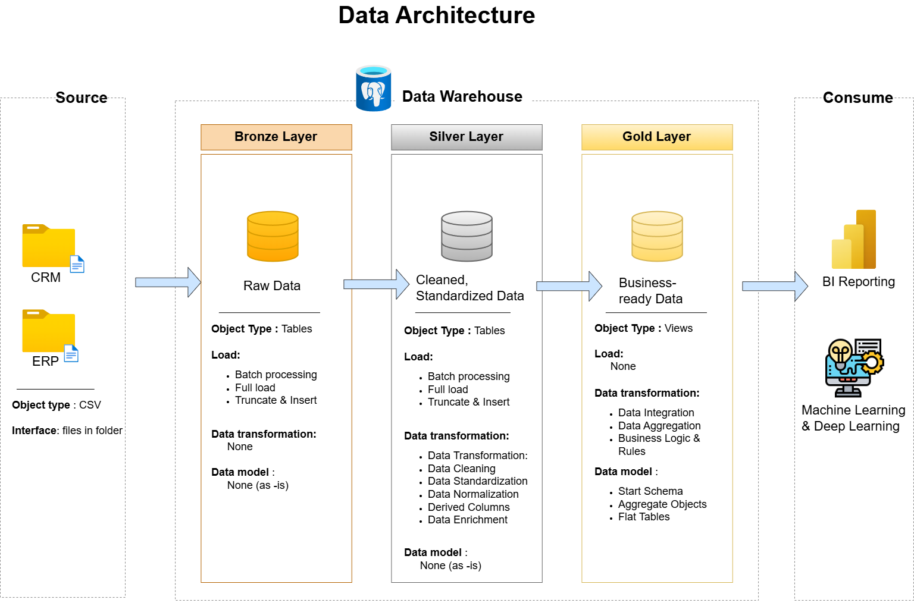

# Data Warehouse Project: Medallion Architecture

## 👤 Author
**Thái Ngọc Thanh Mai** GitHub: [data-with-thanh-mai](https://github.com/data-with-thanh-mai)

---

## 🎯 Project Overview & Objective

The primary objective of this project is to develop a modern data warehouse using **PostgreSQL** to consolidate sales data, enabling analytical reporting and informed decision-making. 

This project involves a complete end-to-end data engineering lifecycle:
1. **Data Architecture**: Designing a robust data warehouse using the Medallion Architecture (Bronze, Silver, Gold).
2. **ETL Pipelines**: Extracting, transforming, and loading data from disconnected source systems into the centralized warehouse.
3. **Data Modeling**: Developing fact and dimension tables optimized for fast and accurate analytical queries.

### Specifications
- **Data Sources**: Import data from two source systems (ERP and CRM) provided as CSV files.
- **Data Quality**: Cleanse and resolve data quality issues (duplicates, nulls, formatting) prior to analysis.
- **Integration**: Combine both sources into a single, user-friendly data model designed for analytics.
- **Scope**: Focus on the latest dataset only; historization of data (e.g., Slowly Changing Dimensions) is not required for this phase.
- **Documentation**: Provide clear documentation of the data model to support both business stakeholders and analytics teams.

---

## 🏗️ Data Architecture

The data architecture for this project strictly follows the **Medallion Architecture** logic to ensure data quality and scalability:



1. **Bronze Layer**: Stores raw data as-is from the source systems. Data is ingested from CSV Files directly into the PostgreSQL Database using `TEXT` data types to prevent load failures.
2. **Silver Layer**: The cleansing layer. This layer includes data transformation, standardization, and normalization processes to prepare data for downstream analysis.
3. **Gold Layer**: Houses business-ready data modeled into a **Star Schema** (Fact and Dimension tables) required for reporting and BI tools (e.g., Power BI, Tableau).

---

## 📂 Repository Structure

```text
data-warehouse-project/
│
├── datasets/                           # Raw datasets used for the project (ERP and CRM data)
│
├── docs/                               # Project documentation and architecture details
│   ├── data_architecture.drawio        # Draw.io file showing the project's data flow architecture
│   ├── data_catalog.md                 # Catalog of datasets, including field descriptions and metadata
│   ├── data_models.drawio              # Draw.io file for data models (Star Schema mapping)
│   └── naming-conventions.md           # Consistent naming guidelines for tables, columns, and files
│
├── scripts/                            # SQL scripts for ETL and transformations
│   ├── bronze/                         # Scripts for extracting and loading raw data (DDL & Procedures)
│   ├── silver/                         # Scripts for cleaning and transforming data (DDL & Procedures)
│   └── gold/                           # Scripts for creating analytical models (Star Schema Views)
│
├── tests/                              # SQL test scripts and Data Quality Checks
│
├── README.md                           # Project overview and instructions
└── LICENSE                             # License information for the repository
